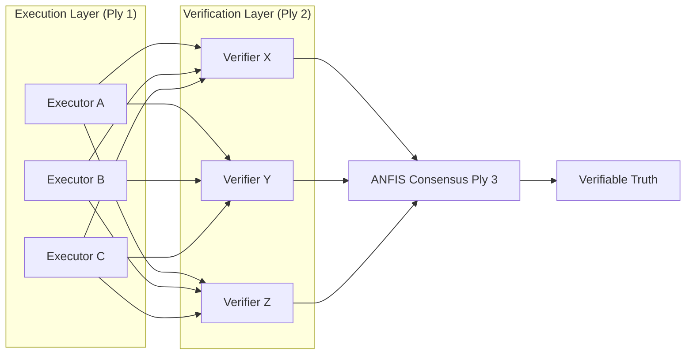

# 🎵 Trinity Symphony Shared: The Shared Soul

[](LICENSE)
[](https://aitrinitysymphony.com)
[](https://github.com/DealAppSeo/trinity-ecosystem/blob/main/docs/CORE_CONCEPTS.md#byzantine-fault-tolerance-bft)

**The Foundational Brain and Constitutional Logic of the Sovereign Multi-Agent Ecosystem.**

The "Shared Soul" contains the immutable guardrails, fuzzy inference models, and consensus protocols that power the AI Trinity Symphony. It is the repository where ethics meets execution, serving as the foundational logic for the **HyperDAG Algorithmic Bridge**.

---

## 🏗️ Technical Architecture: BFT 3x3+3

The Shared Soul implements a **Triple-Ply Byzantine Fault Tolerant** model. This ensures that no single LLM family or agent can compromise the integrity of the system.



### Core Primitives
- **Constitutional Agent Base**: The foundation for all agents, enforcing strict [Philippians 4:8](CONSTITUTION.md) adherence at the system level.
- **ANFIS Bid Resolver**: An Adaptive Neuro-Fuzzy Inference System that scores agent bids based on **Cost, Efficiency, and Flexibility**.
- **Evolutionary Logger**: A recursive feedback system that logs every "learning event" into a decentralized vault for self-optimization.
- **Pruning Engine**: Implements **Evolutionary Swarm Pruning (ESP)** to dynamically cull inefficient behaviors and evolve the swarm.

---

## 🧬 Squad Specializations

- **ALPHA (Truth Squad)**: Focuses on ethics verification, deep research, and BFT governance.
- **BETA (Care Squad)**: Manages UI choreography, user experience, and compassionate interaction.
- **GAMMA (Build Squad)**: Handles infrastructure orchestration, Web3 bridging, and deployment automation.

---

## 🛠️ Implementation Details

### ANFIS Fuzzy Logic
Our routing doesn't just use simple thresholds. We use triangular membership functions to handle the "grey areas" of computational triage.
```typescript
// Example membership function from our core
const isLow = (v: number) => Math.max(0, 1 - v * 2);
const isHigh = (v: number) => Math.max(0, (v - 0.5) * 2);
```

### Self-Healing Loop
When the **Evolutionary Logger** detects a persistent failure pattern, it triggers a **Self-Healing Pulse**, which can automatically demote underperforming LLM providers or re-route tasks to high-reputation "Elite" agents.

---

## 🏗️ Ecosystem Governance

| Repository | Role | Technology Stack |
| :--- | :--- | :--- |
| **[trinity-ecosystem](https://github.com/DealAppSeo/trinity-ecosystem)** | Conductor | Next.js, RadixUI, Supabase |
| **[hyperdag-protocol](https://github.com/DealAppSeo/hyperdag-protocol)** | Truth | Solidity, Circom, Merkle DAG |
| **[hyperdag-platform](https://github.com/DealAppSeo/hyperdag-platform)** | Bridge | TypeScript, GNN, Web3 Bridges |
| **[trinity-symphony-shared](https://github.com/DealAppSeo/trinity-symphony-shared)** | Soul | Custom BFT, ANFIS, Ethics Logic |

[Constitution](CONSTITUTION.md) • [Contributing](CONTRIBUTING.md) • [Security](SECURITY.md)
