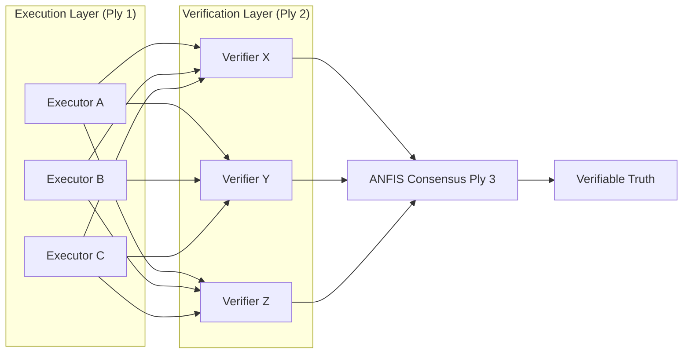

  <h1>trinity-symphony-shared</h1>
  
<strong>Part of the HyperDAG Ecosystem</strong>

  

    
    
  

**Constitutional logic and core BFT primitives for the AI Trinity Symphony.**

`trinity-symphony-shared` is the shared runtime for the 12 Trinity Symphony agents: the constitutional
agent base they all extend, the tool loop they act through, and the safety primitives that can stop them.

**Read the "Live today vs designed" table below before relying on anything here.** An earlier version of
this README described three components — an ANFIS bid resolver, an Evolutionary Logger and a Pruning
Engine — that do not exist in this repository, alongside a fuzzy-membership code sample that was never
lifted from any file here. Those claims have been removed rather than softened.

---

## 🏗️ Technical Architecture: BFT 3x3+3

This package implements a **Triple-Ply Byzantine Fault Tolerant** model, so that no single LLM family or
agent can compromise the integrity of a decision.

### Core primitives — what is actually in this repo

| Primitive | File | What it does |
|---|---|---|
| **Constitutional agent base** | `constitutional-agent-base.js` (2,627 lines) | The foundation every agent extends, enforcing [Philippians 4:8](CONSTITUTION.md) adherence at the system level |
| **Constitutional agent V4** | `lib/ConstitutionalAgentV4.js` (3,049 lines) | The current agent implementation — HTTP surface, tool-call loop, hash-chained audit |
| **Swarm toolbelt** | `lib/swarm-toolbelt.js` (287 lines) | The instruments an agent acts through: `http_get`, `read_engine_stats`, `report_unmeasurable`. Default OFF behind `SWARM_TOOLBELT=on` |
| **L0 emergency halt** | across the tick loops | A global stop, with a coverage test that scans the filesystem for tick loops so it fails when a new one is added ungated |

**Why the toolbelt matters more than it looks.** Before it existed the agents had exactly one tool —
`save_artifact` — so an agent asked to *measure* something had no instrument and one affordance: write
prose. 18 of 18 nightly smoke reports contained zero real measurements. That was fabrication by
construction, not by disposition. `report_unmeasurable` is the tool that lets an agent decline.

---

## Live today vs designed

| Live today | How to check |
|---|---|
| 12 constitutional agents on a shared base | `constitutional-agent-base.js`, `lib/ConstitutionalAgentV4.js` |
| Tool-call loop with a real toolbelt | `lib/swarm-toolbelt.js`; proven 2026-08-05 — three probes returned live engine values matching independently-captured ground truth, and a fourth **declined to answer** a question no tool could reach |
| `report_unmeasurable` — an agent can refuse | same file; this is what makes the refusal above possible |
| L0 global emergency halt | filesystem-scanning coverage test fails when a new tick loop is added ungated |
| Hash-chained audit of tool calls | `lib/ConstitutionalAgentV4.js` |
| 13 test files | `tests/` |

| Designed or partial — **not** live here | Actual state |
|---|---|
| ANFIS fuzzy inference / bid resolution | name only; no weights read or written (see above) |
| Self-healing provider demotion | inputs collected, nothing reads them back |
| Evolutionary pruning | not present in this repository |
| Routing confidence | hardcoded `0.9`, persisted as if measured |

---

## 🧬 Squad Specializations

- **ALPHA (Truth Squad)**: Ethics verification, deep research, and BFT governance.
- **BETA (Care Squad)**: UI choreography, user experience, and interaction.
- **GAMMA (Build Squad)**: Infrastructure orchestration, Web3 bridging, and deployment automation.

---

## 🛠️ Implementation Details

### What "ANFIS" currently means in this repo

Two call sites carry the name, and neither performs fuzzy inference today:

- `callAnfisReward()` (`constitutional-agent-base.js:1671`) records provider performance via
  `trackProviderPerformance()` and writes an audit log line. Its comment says "ANFIS logic to adjust
  weights based on performance"; **no weight is read or written.**
- `selectStorageTier()` (`:1951`) is an if/else over query type, latency budget and sensitivity, with
  `let confidence = 0.9` hardcoded — then persisted to `db_routing_decisions.confidence` as though it
  had been measured.

The adaptive-neuro-fuzzy design is real and specified elsewhere in the project. It is **not implemented
here**, and this README previously implied otherwise with a code sample that exists in no file in this
repository.

### Self-healing — designed, partially built

`trackProviderPerformance()` records provider success and latency, so the INPUT a self-healing loop
needs is being collected. Automatic demotion of underperforming providers and reputation-based
re-routing are **not wired**: nothing currently reads that record back to change a routing decision.

The one safety loop that IS live is the opposite of self-healing — it is self-stopping. The L0 emergency
halt can stop every tick loop, and its coverage test scans the filesystem for tick loops so that adding a
new ungated one fails the build.

---

## 🏗️ Ecosystem Governance

The **protocol-wide** governance roadmap (RepID formula, Pythagorean Comma damping, peer-verification thresholds, the V1 → V3 path toward a DAO) is canonical at
[**hyperdag-protocol / GOVERNANCE_ROADMAP.md**](https://github.com/DealAppSeo/hyperdag-protocol/blob/main/GOVERNANCE_ROADMAP.md).

This repo (`trinity-symphony-shared`) governs the **swarm-local** surface that runs on top of the protocol:

- **Agent constitutions** — what an individual agent will and will not do
- **Swarm policies** — BFT quorum thresholds, ALPHA Truth Squad rules, squad-role escalation paths
- **Ethics logic** — the kernel that adjudicates agent decisions before they propagate

| Repository | Role | Technology Stack |
| :--- | :--- | :--- |
| **[hyperdag-protocol](https://github.com/DealAppSeo/hyperdag-protocol)** | Truth | Solidity, Circom, Merkle DAG |
| **[trinity-symphony-shared](https://github.com/DealAppSeo/trinity-symphony-shared)** | Soul | Custom BFT, ANFIS, Ethics Logic |

[Constitution](CONSTITUTION.md) • [Contributing](CONTRIBUTING.md) • [Security](SECURITY.md)

---

## 🔗 Ecosystem Projects

- [TrustShell](https://trustshell.dev) — Web3 Agent SDK
- [TrustRepID](https://trustrepid.dev) — Reputation leaderboard and verification dashboard
- [TrustChat](https://trustchat.dev) — Secure client chat experience
- [hyperdag-protocol](https://github.com/DealAppSeo/hyperdag-protocol) — L1 validation specification
- [repid-engine](https://github.com/DealAppSeo/repid-engine) — Open-source behavioral reputation scoring engine

---

## 🤝 Contributing

Community contributions are welcome. See [`.github/CONTRIBUTING.md`](.github/CONTRIBUTING.md) to get started — bug fixes, documentation improvements, and feature proposals are all appreciated.

---

**Part of the HyperDAG Protocol ecosystem.**

- [TrustShell](https://trustshell.dev) — SDK
- [TrustRepID](https://trustrepid.dev) — Reputation leaderboard
- [TrustChat](https://trustchat.dev) — Consumer experience
- [HyperDAG Protocol](https://github.com/DealAppSeo/hyperdag-protocol) — Protocol spec

ERC-8004 compatible. Apache 2.0 licensed. Micah 6:8.

**On-chain footprint (Base Sepolia, chain ID 84532):**
- IdentityRegistry — [`0x8004A818BFB912233c491871b3d84c89A494BD9e`](https://sepolia.basescan.org/address/0x8004A818BFB912233c491871b3d84c89A494BD9e)
- ReputationRegistry — [`0x8004B663056A597Dffe9eCcC1965A193B7388713`](https://sepolia.basescan.org/address/0x8004B663056A597Dffe9eCcC1965A193B7388713)
