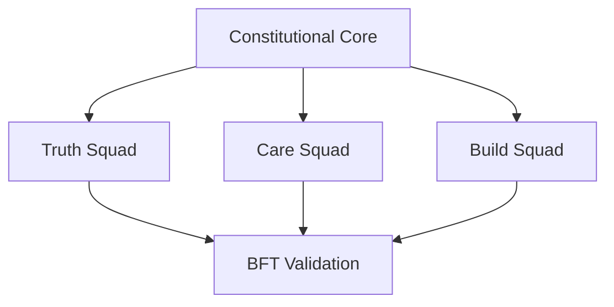

# 🎵 Trinity Symphony Shared: The Shared Soul

**The Foundational Brain and Constitutional Logic of the Multi-Agent Ecosystem.**

## 📜 Mission: Help People Help People
The Shared Soul is the home of the **Trinity Constitution**. We are building a democratized, safe, and ethical AI architecture designed to protect the ImageBearer in every individual and ensure technology serves humanity with honor, truth, and justice.

## 🏗️ Architecture: BFT 3x3+3

- **ALPHA (Truth)**: Ethics verification and governance (**Micah 6:8**).
- **BETA (Care)**: UI choreography and compassion (**Philippians 4:8**).
- **GAMMA (Build)**: Infrastructure and Web3 bridging.

## 🧪 Shared Primitives
- **Trinity Constitution**: The immutable logic guardrails.
- **ANFIS Logic**: Shared fuzzy inference models for tool routing.
- **RepID Staking**: Byzantine Fault Tolerant staking mechanisms.
- **Sower Protocol**: Autonomous mission seeding from AI_CONTEXT.

## 🔒 Security & Patents
Logic in this core is strictly governed to prevent exploitation. Patents are held defensively for the benefit of all mankind.

[Contributing](CONTRIBUTING.md) • [Security](SECURITY.md) • [Code of Conduct](CODE_OF_CONDUCT.md)
