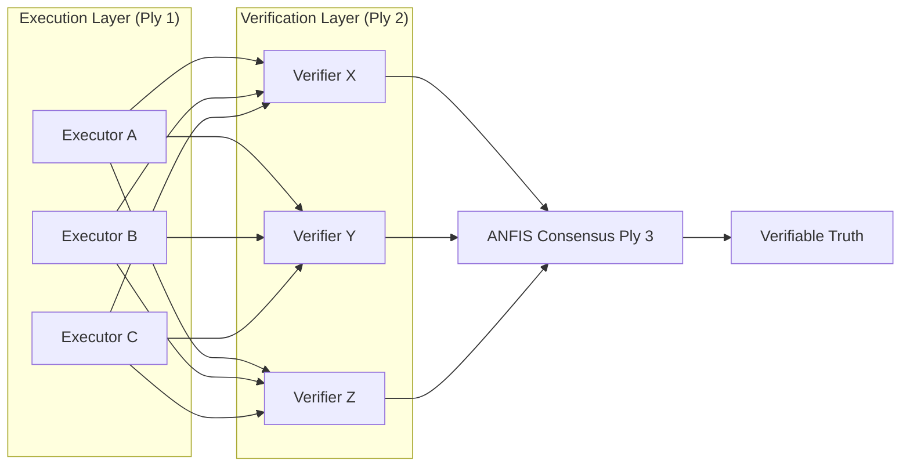

<div align="center">
  <h1>trinity-symphony-shared</h1>
  <p><strong>Part of the HyperDAG Ecosystem</strong></p>
  <p>
    
    
  </p>
</div>

[](LICENSE)
[](https://aitrinitysymphony.com)
[](https://github.com/DealAppSeo/trinity-ecosystem/blob/main/docs/CORE_CONCEPTS.md#byzantine-fault-tolerance-bft)

**Constitutional logic and core BFT primitives for the AI Trinity Symphony.**

`trinity-symphony-shared` contains the guardrails, fuzzy-inference models, and consensus protocols used by
the Trinity Symphony agents. It provides the constitutional agent base, the ANFIS bid resolver, and the
shared BFT validation primitives the swarm relies on.

---

## 🏗️ Technical Architecture: BFT 3x3+3

This package implements a **Triple-Ply Byzantine Fault Tolerant** model, so that no single LLM family or
agent can compromise the integrity of a decision.



### Core Primitives
- **Constitutional Agent Base**: The foundation for all agents, enforcing [Philippians 4:8](CONSTITUTION.md) adherence at the system level.
- **ANFIS Bid Resolver**: An Adaptive Neuro-Fuzzy Inference System that scores agent bids on **Cost, Efficiency, and Flexibility**.
- **Evolutionary Logger**: A recursive feedback system that logs each "learning event" into a vault for self-optimization.
- **Pruning Engine**: Implements **Evolutionary Swarm Pruning (ESP)** to cull inefficient behaviors over time.

---

## 🧬 Squad Specializations

- **ALPHA (Truth Squad)**: Ethics verification, deep research, and BFT governance.
- **BETA (Care Squad)**: UI choreography, user experience, and interaction.
- **GAMMA (Build Squad)**: Infrastructure orchestration, Web3 bridging, and deployment automation.

---

## 🛠️ Implementation Details

### ANFIS Fuzzy Logic
Routing uses triangular membership functions rather than simple thresholds, to handle the "grey areas" of
computational triage.
```typescript
// Example membership function from our core
const isLow = (v: number) => Math.max(0, 1 - v * 2);
const isHigh = (v: number) => Math.max(0, (v - 0.5) * 2);
```

### Self-Healing Loop
When the **Evolutionary Logger** detects a persistent failure pattern, it triggers a **Self-Healing Pulse**,
which can demote underperforming LLM providers or re-route tasks to higher-reputation agents.

---

## 🏗️ Ecosystem Governance

| Repository | Role | Technology Stack |
| :--- | :--- | :--- |
| **[trinity-ecosystem](https://github.com/DealAppSeo/trinity-ecosystem)** | Conductor | Next.js, RadixUI, Supabase |
| **[hyperdag-protocol](https://github.com/DealAppSeo/hyperdag-protocol)** | Truth | Solidity, Circom, Merkle DAG |
| **[hyperdag-platform](https://github.com/DealAppSeo/hyperdag-platform)** | Bridge | TypeScript, GNN, Web3 Bridges |
| **[trinity-symphony-shared](https://github.com/DealAppSeo/trinity-symphony-shared)** | Soul | Custom BFT, ANFIS, Ethics Logic |

[Constitution](CONSTITUTION.md) • [Contributing](CONTRIBUTING.md) • [Security](SECURITY.md)

---

## 🔗 Related Projects in the Ecosystem

- [hyperdag-protocol](https://github.com/DealAppSeo/hyperdag-protocol) — The L1 specification.
- [hyperdag-core](https://github.com/DealAppSeo/hyperdag-core) — ZKP primitives.
- [trinity-symphony-shared](https://github.com/DealAppSeo/trinity-symphony-shared) — Agent infrastructure.
- [repid](https://github.com/DealAppSeo/repid) — The reputation engine.
- [trustrepid](https://github.com/DealAppSeo/trustrepid) — SDK and integration layer.

## 🤝 Contributing

Community contributions are welcome. See [`.github/CONTRIBUTING.md`](.github/CONTRIBUTING.md) to get
started — bug fixes, documentation improvements, and feature proposals are all appreciated.
